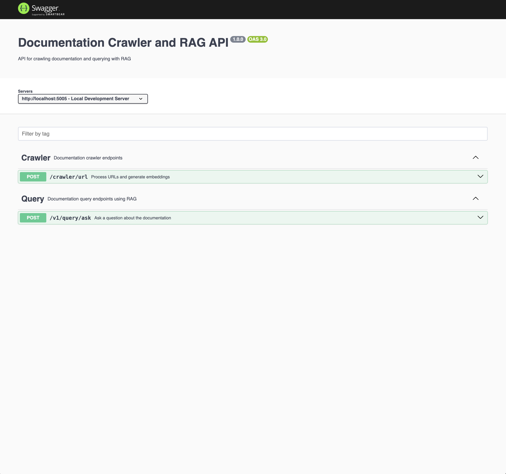

# Documentation RAG Agent

An intelligent documentation crawler and RAG (Retrieval-Augmented Generation) agent built using LangChain, Supabase, and OpenAI. The agent can crawl documentation websites, store content in a vector database, and provide intelligent answers to user questions by retrieving and analyzing relevant documentation chunks.

## Features

- URL crawling and content extraction
- Document embedding generation
- RAG (Retrieval-Augmented Generation) for document querying
- Swagger API documentation
- Redis caching for improved performance

## Prerequisites

- Node.js (v18 or higher)
- TypeScript
- Redis server (for caching)

## Installation

1. Clone the repository
2. Install dependencies:
   ```bash
   npm install
   ```
3. Create a `.env` file with the following variables:
   ```env
   PGHOST=your_host
   PGPORT=your_port
   PGUSER=your_user
   PGPASSWORD=your_password
   PGDATABASE=your_database
   OPENAI_API_KEY=your_api_key
   OPEN_AI_MODEL_NAME=gpt-3.5-turbo
   REDIS_CACHE_HOST_ENDPOINT=your_redis_endpoint
   NODE_ENV=local
   PORT=5005
   DEFAULT_CACHE_TTL=3600
   ```

## Starting the Server

1. Development mode:
   ```bash
   npm run server
   ```
   This will start the server using ts-node, allowing direct execution of TypeScript files.

2. Production mode:
   ```bash
   npm run build
   npm start
   ```
   This will compile the TypeScript files and run the compiled JavaScript.

The server will be available at:
- API: `http://localhost:5005` (or your configured PORT)
- Swagger Documentation: `http://localhost:5005/api-docs`

## API Endpoints



### Crawler

- `POST /v1/crawler/url`
  - Crawl and process URLs to generate embeddings
  - Example request:
    ```json
    {
      "urls": ["https://www.nysenate.gov/legislation/laws/ABC/60"]
    }
    ```

### Query

- `POST /v1/query/ask`
  - Query the processed documents using RAG
  - Example request:
    ```json
    {
      "question": "What are the requirements for..."
    }
    ```

## Available Scripts

- `npm run server` - Start the API server
- `npm run build` - Build the TypeScript files
- `npm start` - Run the built JavaScript files
- `npm test` - Run tests
- `npm run embeddings` - Generate embeddings for documents

## Development

The API is built using:
- Express.js for the web server
- Swagger for API documentation
- Redis for caching
- OpenAI for embeddings and RAG

For more details, check the Swagger documentation at `/api-docs` when the server is running.

# Execute the functions in this order
1. Create a function that takes in an Array of URLS.
2. Use the `requiresJavaScript` function to check if any of the URLs require JavaScript.
3. If it does not require JavaScript, use the `crawlUrlsWithCheerio` function to crawl the URLS. If it does require JavaScript, use the `crawlUrlsWithPlaywright` function.
4. Use the `convertHtmlToMarkdown` function to convert the HTML content of the URLs to Markdown.
5. Use the `createChunks` function to split the Markdown content into chunks.
6. Use the `generateEmbeddings` function to generate embeddings from the chunks.
7. Use the `insertDocuments` function to insert the generated embeddings into the vector database.
